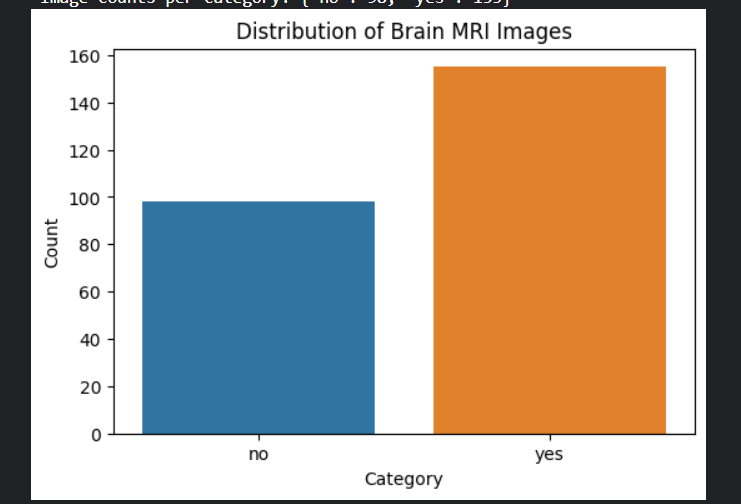
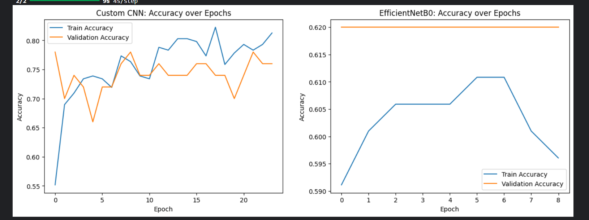

# Brain Tumor Detection from MRI Scans

## Dataset
- [Brain MRI Images for Brain Tumor Detection (Kaggle)](https://www.kaggle.com/datasets/navoneel/brain-mri-images-for-brain-tumor-detection)
- MRI scans labeled as ‘Tumor’ or ‘No Tumor’

.png)

## Method
- Custom CNN (baseline)
- EfficientNetB0 (transfer learning, fine-tuned)
- Data augmentation: rotation, flip, zoom

## Results
- Custom CNN: **72%** validation accuracy
- EfficientNetB0: Improved after fine-tuning

# Brain Tumor Detection from MRI Scans

## Dataset
- [Brain MRI Images for Brain Tumor Detection (Kaggle)](https://www.kaggle.com/datasets/navoneel/brain-mri-images-for-brain-tumor-detection)
- MRI scans labeled as ‘Tumor’ or ‘No Tumor’

## Method
- Custom CNN (baseline)
- EfficientNetB0 (transfer learning, fine-tuned)
- Data augmentation: rotation, flip, zoom

## Results
- Custom CNN: **72%** validation accuracy
- EfficientNetB0: Improved after fine-tuning

